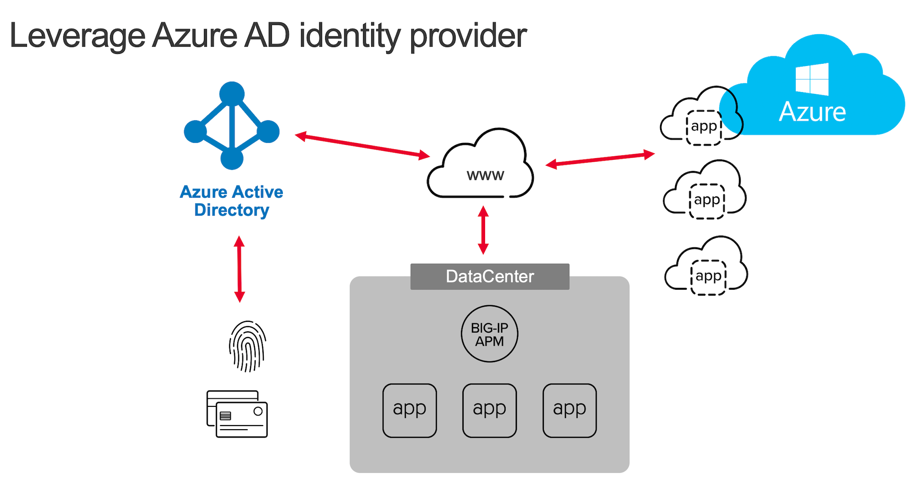

Welcome to Azure AD Easy Button integration lab guide
#####################################################

Publish and protect on-prems apps with Azure AD as identity provider
********************************************************************

.. warning :: For any remark or mistake in this lab, please send a Teams chat to Matthieu DIERICK.

In this lab, you will learn how to connect APM to Azure AD as IDaaS. Since v15.1, you can enable APM as SAML SP and Azure AD as SAML IDP. 
In this lab, we will use the new **Easy Button** Guided Configuration template. This template:

#. Publish on-prems apps
#. Enable Single Sign on
#. Interconnect (SAML binding) APM with Azure AD tenant

.. note :: you will notice we will never connect to Azure AD interface. APM will use Microsoft Graph API to configure AAD tenant accordingly.

.. toctree::
   :maxdepth: 2
   :caption: Contents:
   :glob:

   class*/class*

